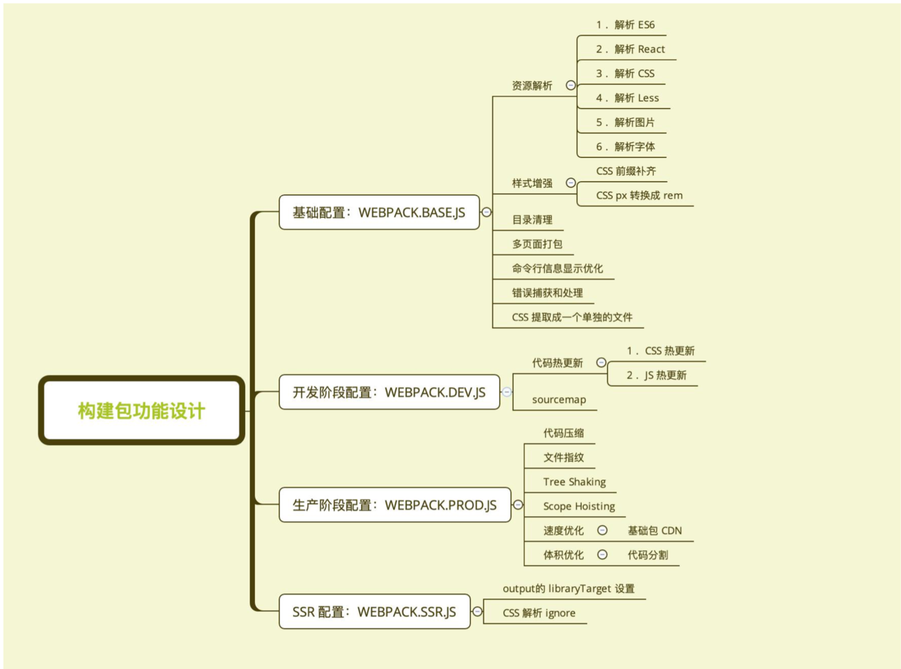

## 文件指纹
一般js文件采用chunckhash，而css文件采用contenthash，图片字体文件用hash

## sourceMap
devtool 设置 
#### eval
没有单独的map文件，把sourcemap放到js文件里。使⽤用eval包裹模块代码
#### source-map
有单独的map文件
#### inline-source-map
把sourcemap放到js文件里。报错定位到行，代码比cheap-source-map干净。
#### cheap-source-map
报错只能定位到行。这一行哪里有错，不能直接定位。

##  公共脚本分离（2种）
### HtmlWebpackExternalsPlugin 基础库分离 用cdn的方式
```js
new HtmlWebpackExternalsPlugin({ //公共库代码分离
            externals: [{
                    module: 'react',
                    entry: 'https://11.url.cn/now/lib/16.2.0/react.min.js',
                    global: 'React',
                },
                {
                    module: 'react-dom',
                    entry: 'https://11.url.cn/now/lib/16.2.0/react-dom.min.js',
                    global: 'ReactDOM',
                },
            ]
        })
```
### splitChunksPlugin 公共脚本分离 比如多个文件同时引用的脚本
#### chunks 参数说明
+ async 异步引入的库进行分离 vue react （import）
+ initial 同步引入的引入的库分离
+ all 所有引入的库分离

### 按需加载
+ CommonJS:require.ensure
+ ES6:动态 import(⽬目前还没有原⽣生⽀支持，需要 babel 转换)（vue-router）

### scope hoisting 


### 速度优化策略
##### 分析插件
+ speed-measure-webpack-plugin 分析整个打包总耗时，每个插件和loader的耗时情况
+ webpack-bundle-analyzer 分析体积,依赖的第三方模块文件大小,业务里面的组件代码大小(会在浏览器图片展示)

##### 优化
###### 多进程、多实例构建
1. HappyPack webpack3使用
2. thread-loader webpack4使用

每次 webpack 解析一个模块，thread- loader 会将它及它的依赖分配给 worker 线程中

###### 并行压缩
1. 使用 parallel-uglify-plugin 插件
2. uglifyjs-webpack-plugin 开启 parallel 参数
3. terser-webpack-plugin 开启 parallel 参数 (比2好，能编译es6)

###### 分包
使用 DLLPlugin 进行分包，DllReferencePlugin 对 manifest.json 引用。


###### 使用缓存
提升二次构建速度。
· babel-loader 开启缓存
· terser-webpack-plugin 开启缓存
· 使用 cache-loader 或者 hard-source-webpack-plugin


###### 缩小构建目标（1.减少文件搜索范围，2.文件名）
优化 resolve.modules 配置(减少模块搜索层级) 优化 resolve.mainFields 配置
优化 resolve.extensions 配置
合理使用 alias

### 体积优化
###### Scope Hoisting 
+ 原理:将所有模块的代码按照引⽤用顺序放在⼀一个函数作⽤用域⾥里里，然后适当的重命名⼀一
些变量量以防⽌止变量量名冲突
+ 对⽐: 通过 scope hoisting 可以减少函数声明代码和内存开销

###### Tree-shaking 

###### 公共资源分离 
###### 图片压缩
+ image-webpack-loader
+ pngquant

###### 动态 Polyfill
识别 User Agent，下发不同的 Polyfill。有开源库。也可自己选择自己要Polyfill的功能。如：promise

### 功能模块设计
